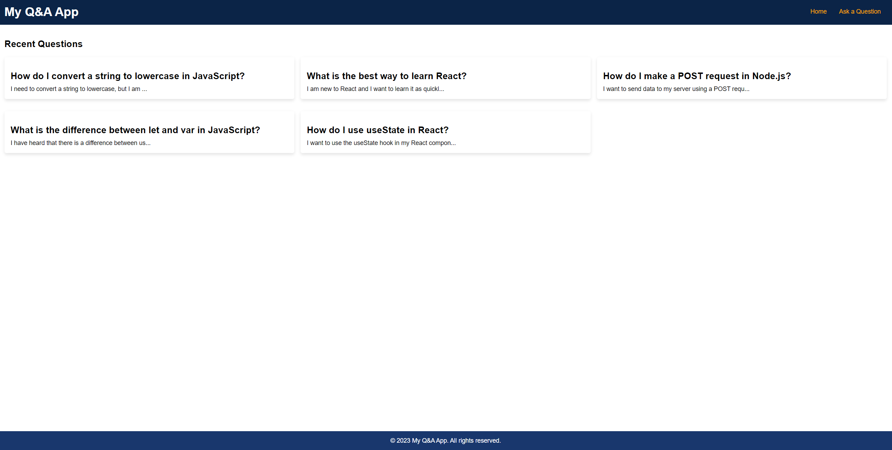
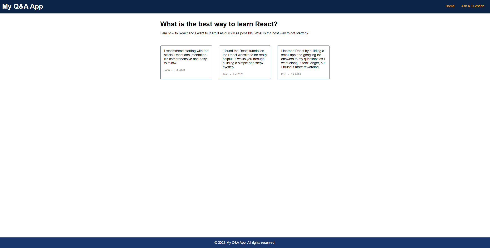
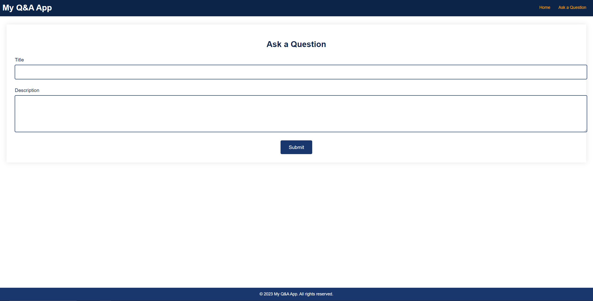

# ChatGPT-Prompt-Only

Building React app with just ChatGPT prompts

## The goal

The goal was to test how well free tier of ChatGPT (3.5) can give code snippets to create frontend web application.
I aimed to create frontend for Question & Answers (Q&A) application, no data fetching, only dummy data.

## Notes

- Initially I was planning to use the snippets as is, no manual fixes, but I quickly realized some fixes had to be made.
- On first day I received many network errors and prompting was slow, and resulted in many failed prompts which are also documented here.
- Second day went much smoother, and I could have achieved a lot more prompts if day 1 had this level of success.

## Results

I managed to create 3 pages:

- Main page
- Question & Answer page
- Ask a Question page
- (Not found page)

And relevant components:

- Header
- Footer
- Question card
- Answer card
- Question Form

### Pros

- It was able to give me all components I asked
- It understood react routing (although old syntax since old data)
- It could change simple mapped components to grid with 3 columns
- It remembered context (make Header, later asked to add it to Q&A page)

### Cons

- It "hallucinated" and/or replaced props, tags and such while giving updated component
- It didn't remember requirements that well (except using TS all the way), such as main colors for the page
- Maybe due to network errors, but I couldn't give it long detailed prompts, it was too slow and response was cut
- Many prompts were needed to correct it when it didn't understood what I asked for (asked to give example of prop data, gives the interface instead)

### Use cases

These are the use cases I deem it may be useful as of now:

- Can remind of syntax
- Can give examples of unfamiliar language or framework
- Can give ideas
- Can give CSS snippets, for example a specific animation

### Do I use it at work or do I see the need for it?

Not yet

### Will AI replace programmers?

Maybe some day,

<iframe src="https://giphy.com/embed/zvPijis9AXQ7S" width="480" height="266" frameBorder="0" class="giphy-embed" allowFullScreen></iframe>
<a href="https://giphy.com/gifs/day-world-braveheart-zvPijis9AXQ7S">via GIPHY</a>

## Prompt count

- 30 prompts
- 1 bonus prompt
- 1 wrapping up prompt

## Time elapsed

~4 hours.

### Screenshots

